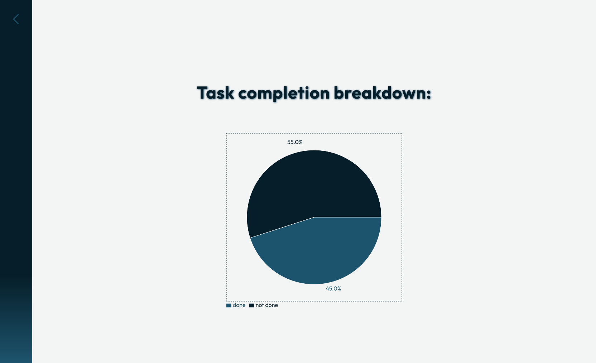
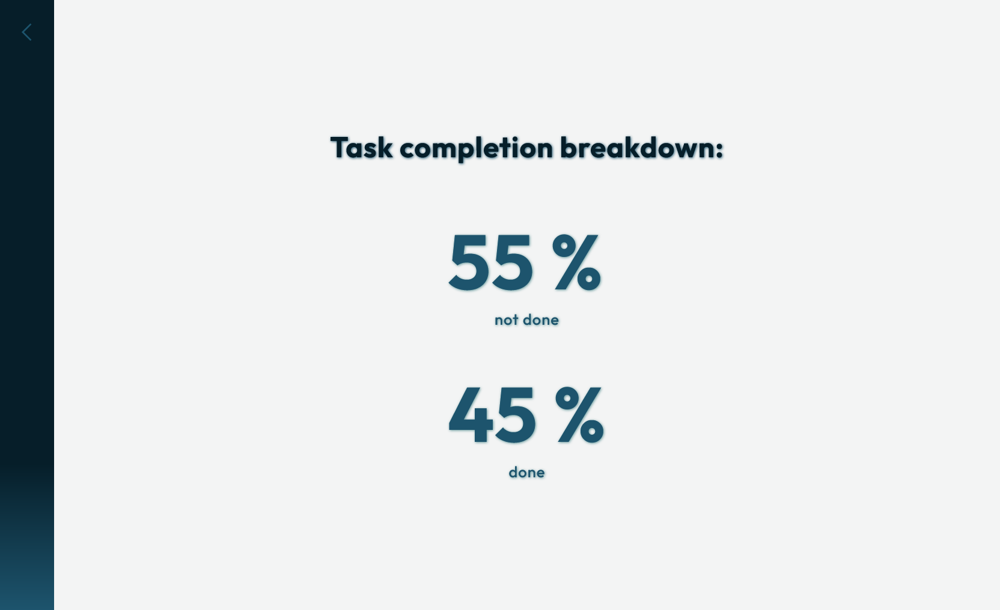
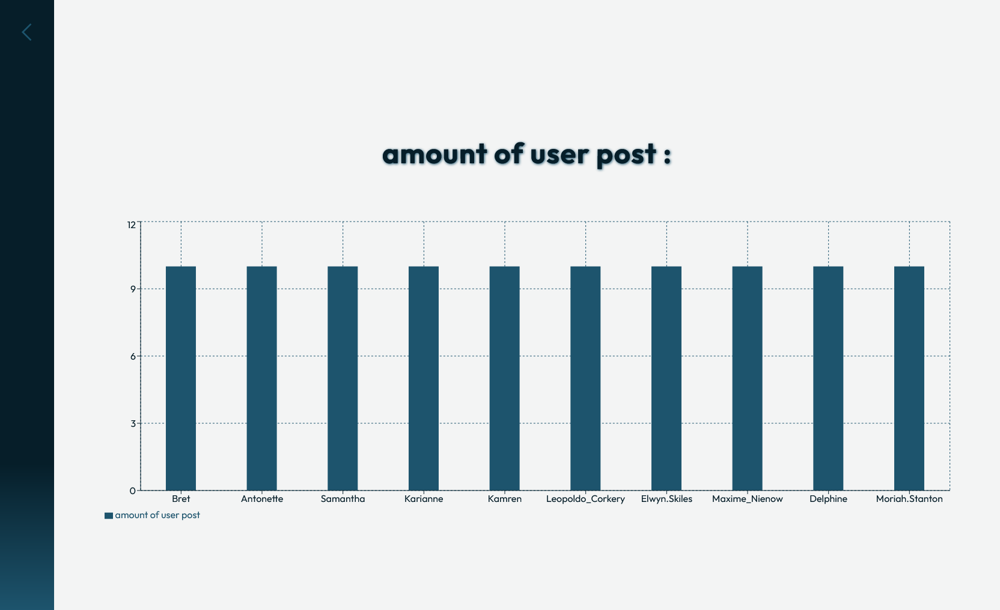

# Data-Visualizer

A simple web application for fetching data from a public API, calculating basic statistics, and visualizing the results using charts.


## Project Overview

This application:
1. Fetches data from a public API:  
   [ https://jsonplaceholder.typicode.com](https://jsonplaceholder.typicode.com)
2. Processes the data and calculates basic statistics (e.g. number of posts, number of comments, average comments per post).
3. Visualizes the results using charts (bar charts, pie charts).

The project is intended as a practical example of working with APIs, data processing, and visualization in React.

## Build & Run Locally

```bash
npm install
npm start
```
The application will be available at:
```bash
http://localhost:3000
```
## Live Demo
The application is deployed using **GitHub Pages** and is publicly available:

[https://mariamajchrzak.github.io/Data-Visualizer/](https://mariamajchrzak.github.io/Data-Visualizer/)

## Technologies

- React
- JavaScript
- Fetch API
- Recharts library
- JSONPlaceholder API

## Screenshots

Below are example screenshots showcasing the application.





## AI Usage 

During the development of this project, AI tools were used to assist with:

- Checking code syntax.
- Helping to write README content.
- Assisting with the use of the **Recharts** library for data visualization.

AI was used only as a helper tool.